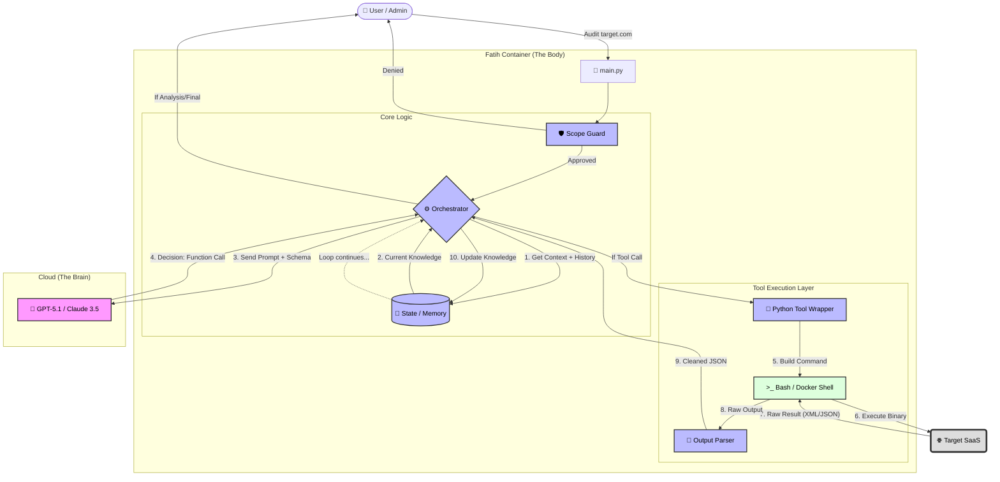

# 🏛️ Fatih Architecture & Process Flow

This document visualizes how the **Fatih AI Agent** operates, thinks, and executes attacks.

## The Conquest Loop (ReAct Pattern)

The system is designed as an infinite loop of **Reasoning** and **Acting**, controlled by the central State Manager.

