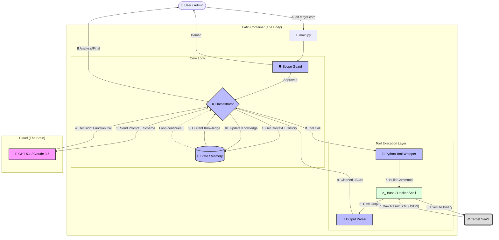

<div align="center">


# F A T I H

**The Autonomous AI Penetration Testing Agent**

[](https://github.com/Nezir66/fatih)
[](https://www.docker.com/)
[](https://openai.com/)

---

</div>

## 🎯 What is Fatih?

**Fatih** is an autonomous AI agent designed to perform comprehensive security audits on web applications. Unlike traditional scanners that simply list vulnerabilities, Fatih uses a **Reasoning Loop** (Observe → Orient → Decide → Act) to intelligently explore, analyze, and validate findings.

It runs in a secure, isolated **Docker** environment ("The Body") controlled by a powerful Cloud AI ("The Brain"), bridging the gap between static analysis and human-like penetration testing.

## ✨ Features

- **🧠 Autonomous Reasoning Engine**: Built on the ReAct pattern, Fatih creates dynamic plans, executes tools, and adapts its strategy based on real-time feedback.
- **🛡️ Secure Isolation**: All dangerous operations run inside a sandboxed Docker container (Debian Bookworm), keeping your host system safe.
- **🔍 Deep Reconnaissance**:
  - **Subdomain Discovery**: Integrated with **Subfinder** to map attack surfaces.
  - **Port Scanning**: intelligent **Nmap** execution to identify open services.
  - **Web Crawling**: Uses **Katana** and **Httpx** for deep endpoint discovery and technology stack detection.
  - **Fuzzing**: Directory and file brute-forcing with **ffuf**.
- **💾 State Management**: Persistent memory of hosts, ports, and vulnerabilities across sessions.

## 🏗️ Architecture

Fatih emulates a human penetration tester's methodology using a sophisticated agentic architecture.



## 🚀 Getting Started

### Prerequisites

- **Docker & Docker Compose**
- **API Key** (OpenAI or Anthropic)

### Installation

1.  **Clone the Repository**

    ```bash
    git clone https://github.com/Nezir66/fatih.git
    cd fatih
    ```

2.  **Configure Environment**

    Create a `.env` file in the root directory:

    ```ini
    OPENAI_API_KEY=sk-proj-xxxxxxxx...
    anthropic_api_key=sk-ant-xxxx...
    LOG_LEVEL=INFO
    ```

3.  **Awake Fatih (Build & Run)**

    ```bash
    docker-compose up --build
    ```

## 🛠️ Usage

Once running, Fatih will wait for instructions via the CLI entry point.

```bash
# Example Workflow
> Fatih, audit target.com
[+] Checking Scope... OK
[+] Starting Recon on target.com...
[+] Found 3 subdomains.
[+] Scanning ports...
...
```

## ⚠️ Disclaimers

### Important Usage Guidelines

**1. Potential for Mutative Effects**
This is not a passive scanner. Fatih is designed to **actively interact** with the target. This process can have mutative effects (e.g., submitting forms, triggering alerts).

**2. Legal & Ethical Use**
Fatih is designed for legitimate security auditing purposes only.

> [!CAUTION]
> **You must have explicit, written authorization** from the owner of the target system before running Fatih.
>
> Unauthorized scanning and exploitation of systems you do not own is illegal. The maintainers are not responsible for any misuse of this tool.

## 🤝 Contributing

Contributions are welcome! Please feel free to submit a Pull Request.

---

<p align="center">
  <b>Built with ❤️ by Nezir66</b><br>
  <i>Empowering Security through Autonomous AI</i>
</p>
